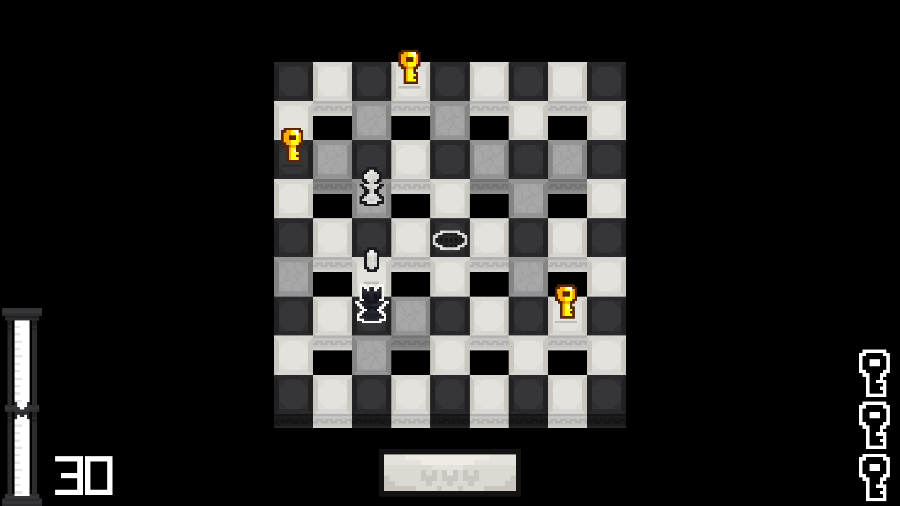
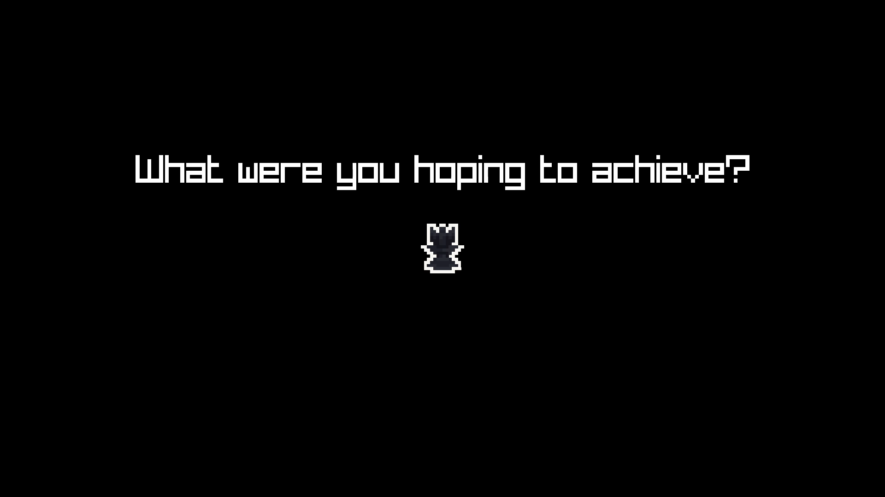
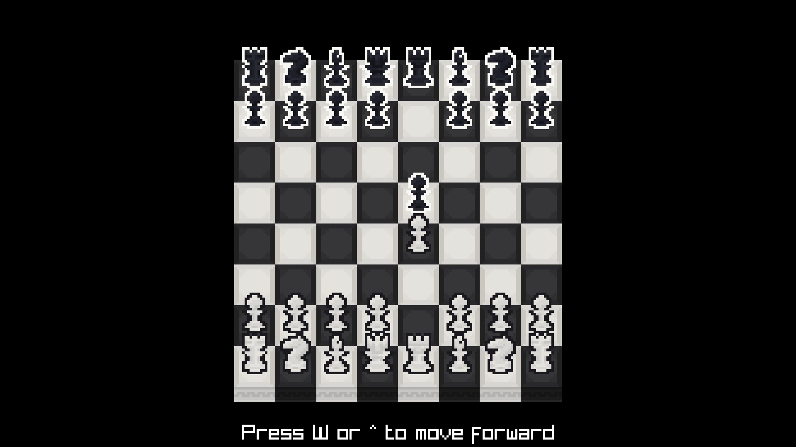
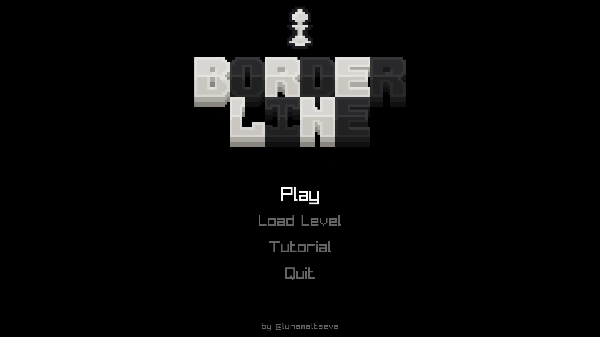
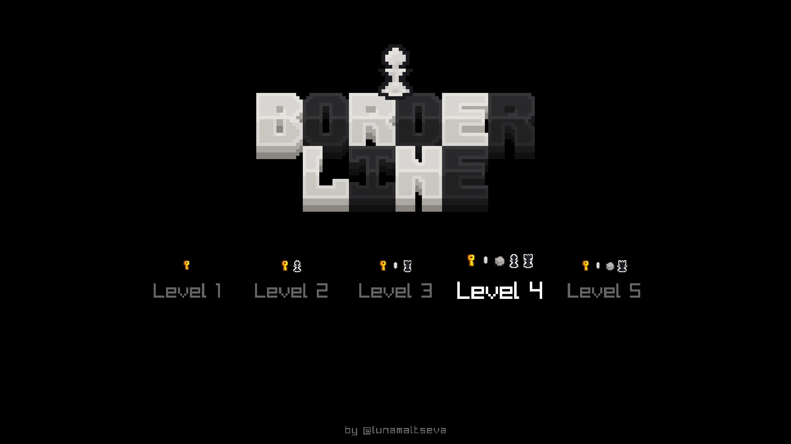
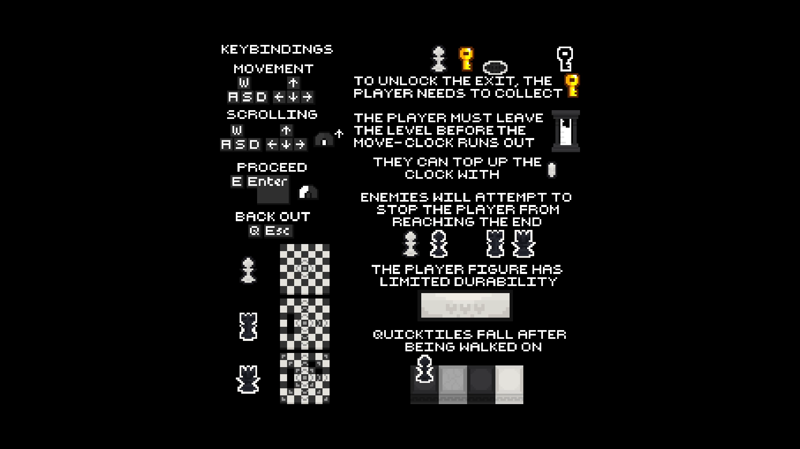
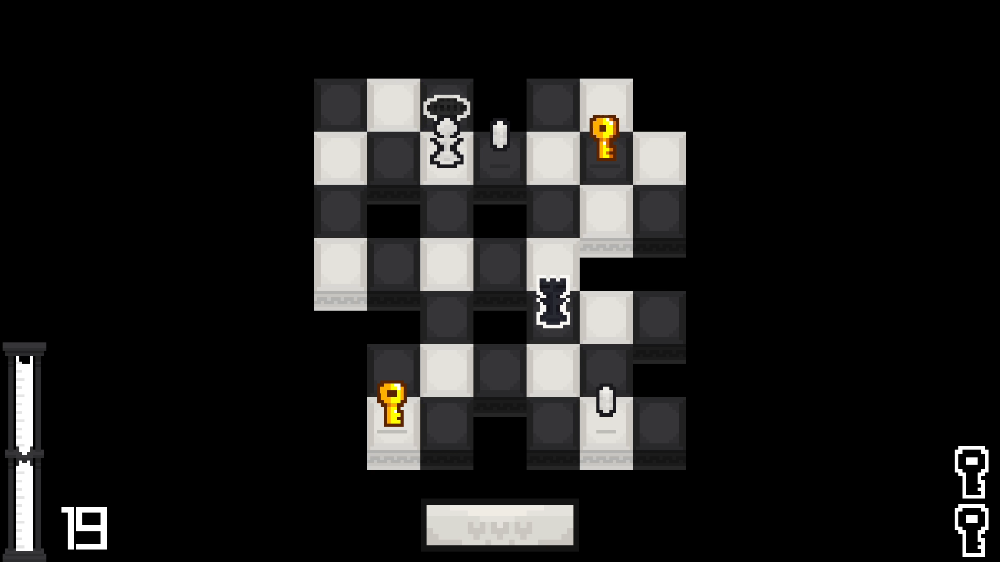
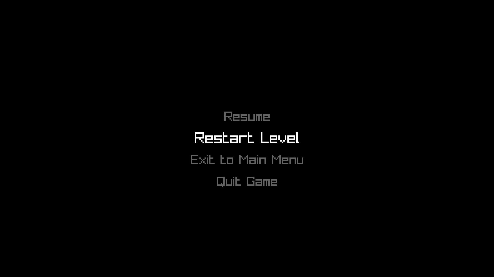
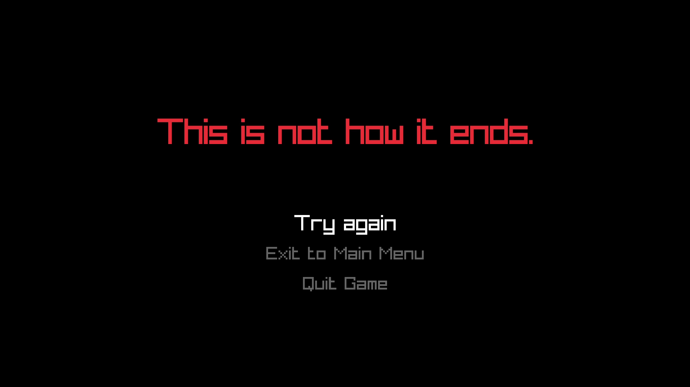
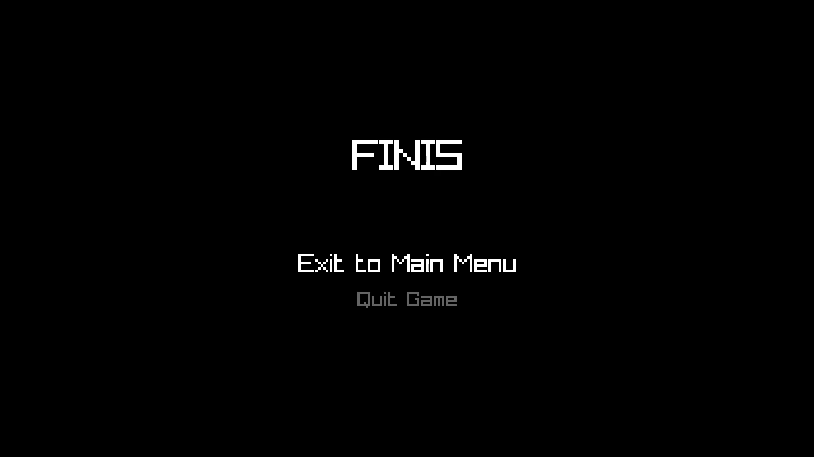

<h1 align=center> COM-122 2023F Project 02: Border Line </h1>
<h5 align=center> <a href="https://drive.google.com/file/d/1IxPmukBoAzAqOVEdXFzdaOiZ4At9K2Yq/view?usp=sharing"> Game walkthrough </a> </h5>

**Border Line** is a puzzle-esque unnerving dungeon crawler set on a chess board with untraditional rules. The goal of the game is to beat all five levels. Each level is more difficult than the previous one. There are multiple ways to solve every level.

<h2 align=center> Features </h2>

##### The Board
The foundation of every level is the layout of the board. It is made up of `Regular`, `Void`, and `Quick` tiles, and has one `Exit`, and constitutes the first difficulty to the player: navigation. 

| Image | Board | Description |
| :---: | :---: | :--- |
|   | Regular | These are here to make the board look chess-themed |
| | Void | If any figure steps onto it, it will fall |
|  | Quick Tiles | Turns into `Void` after being walked over |
|  | Closed Exit | Shows where the exit will be after all the `Key`s are collected |
|  | Exit | Moves the player to the next level |

##### The Pieces
Playing on the board are the pieces. The `Player Pawn` (player) moves through each level, collecting `Key`s, and moving towards the `Exit`. The second challenge to the player are the `Enemy` pieces. The objective of every `Enemy` piece is to get as close to the player as possible. **Every piece has the ability to take any other piece**. Keep in mind that the `Enemy` pieces will sacrifice themselves if they see an opportunity to take the player.

| Image | Figure | Can move... | Its objective is to... | 
| :---: | :---: | :--- | :--- | 
|  | Player Pawn | one tile vertically or horizontally | complete all levels, by collecting all keys and unlocking the exits |
|  | Enemy Pawn | one tile vertically or horizontally | serve as a nuisance to the player |
|  | Enemy Rook | any amount of tiles vertically or horizontally | serve as a solve-able difficulty |
|  | Enemy Queen | any amount of tiles vertically, horizontally, or diagonally | serve as the final boss of the game |

##### The Items

Further complicating navigation, items are dispersed all over the board, making the player build elaborate routes to secure them while avoiding danger to the best of their ability. While `Marble` may seem as an optional collectible, in reality, the player will never leave the level without collecting all items.

| Image | Item | Description | 
| :---: | :---: | :--- | 
|  | Key | When collected, adds to the total number of player's keys |
|  | Marble | When collected, adds 50% to the `Move-clock` |

##### The Mechanics

Even with all of the above, every level can be finished *eventually*. Presenting as the (perhaps) greatest challenge is the `Move-clock`. Every level has a set amount of moves it can handle; if the `Move-clock` runs out, the level will collapse. The player must collect all the keys, avoid being taken by any enemy, and get to the exit before the `Move-clock` runs out. Maintaining that balance will have the player constantly walking on the edge: hence, "**Border Line**". 

Taking inspiration from the early 90s games, **Border Line** provides the player with three lives to get to the end of the game. If the player runs out of lives, the player will have to start over from the level they selected. To serve as an indicator of how many lives the player has: the `Health bar`.

| Image | GUI element | Description | 
| :---: | :---: | :--- | 
|  | Move-clock | Serves as an indicator of how many moves the player began with and how many they are currently on |
|  | Health bar | Indicates on which life the player is |
|  | Keys | Shows how many keys need to be collected on the level |

<h3 align=center> Giving Life to the Dungeon through Animations and Sounds </h3>

The essence of life is in movement; to give significance to the player and the enemies, a decent amount of time was spent on giving nearly every action animation and sound.
- The figures move from cell to cell smoothly; when they walk off the level, they *fall*.
- When the amount of moves is divisible by 5 with no remainder, the `Move-clock` ticks. On the last 5 moves, the `Move-clock` ticks constantly, and an expanding halo outlines the board.
- When the player enters the level, they fall onto it; exiting the level, they jump into the exit. 
- When the player dies, the level fades out, and then fades in again, with the player falling into it.
- When the player runs out of moves, the level shatters and falls.
- Dying, falling, killing, and collecting are all accompanied by sounds.
- When the player runs out of lives, the `Game Over screen` prints "This is not how it ends," word-by-word.
- When entering the `Main Menu`, the screen fades in; when exiting it, the player figure drops from the title down.
- And there is a set of animations dedicated purely to the ending; speaking of which...

<h3 align=center> The Element of Story </h3>

**Border Line**'s perhaps greatest innovation is the element of story. Upon launch, the game begins with an interactive opening, in slides unravelling how the `Player Pawn` was exiled for failing to follow common rules. By the end of the fifth level, the `Enemy Queen` performs a dialogue with the player, emphasizing on the desperate position of the player; if the player still goes against the queen, the queen destroys the `Moves-clock`, by proxy destroying the level, and so, the player.

<h3 align=center> Enhancing User Experience with Good UI </h3>

##### Opening Screen

Upon launching the game, it opens with an opening screen which sets the arena for the game. It consists of six slides; two of which require the player to press `W` or `Up arrow` to advance. On slides 1-4, `Eugenio Mininni - Silent Descent` is playing. The player can skip it by pressing `Esc` || `Enter` || `E` || `Q`, and go directly to the `Main Menu`.

##### The Main Menu Screen

The Main Menu screen acts as a hub to the game. **The player can move between options in all menus using `W A S D`, `arrows`, or their `mouse wheel`. Selecting an item is done by `Left Mouse Button`, `Enter`, or `E`. Going back is done through `Esc` or `Q`.** On this screen, the Main Theme of the game is playing, `Ahjay Stelino - Driving Ambition`. From it, the player can choose to `Play`, which will launch the game into the first level; additionally, they can choose to `Load (a specific) Level`, or view the `Tutorial`. The player can also choose to `Quit the game`.

##### The Load Level Screen

The `Load Level` offers all five levels, with dynamically generated images showcasing what elements the specific levels have. If the player launches a specific level, upon death they will start from that level.

##### The Tutorial Screen

The `Tutorial` outlines controls, game elements, and piece behavior by changing between four different images, creating a visual animation to create an intrinsic understanding of the elements by the player.

##### The Game Screen

Please see instructions above for a detailed overview of the game. The player can move the `Player Pawn` with `W A S D` or `Arrows`.

##### The Pause Screen

The player can enter and quit the `Pause screen` by pressing `Esc`. The `Pause Screen` provides options to resume the game, restart the level, exit to main menu, and quit the game. Restarting the level fully reloads the level and all elements. **Note that if an animation of the player falling, being dead, or being out of moves was underway, a life will be deducted from the player.**

##### The Game Over Screen

The `Game Over screen` is the only screen which uses AnimatedText to print out "This is not how it ends." word-by-word. It provides the options to try again (i.e. start from the last-selected level), exit to main menu, and quit the game.

##### The Dialogue

The `Dialogue` happens when the player has almost left level five. During the `Dialogue`, an eerier piano theme called "Classical" is playing; author unknown. By the end of the `Dialogue`, if the player chooses to exit the level, the ending sequence will initiate.

##### The "Victory" Screen

This screen appears after the player completes the Fifth level. Unlike project01, there are no fireworks here. This screen is meant to leave the player thinking over what happened at the end of the fifth level.

---

 

<h4 align=center> 2'500 lines of code; 14 days of daily work. </h4>

 

<h5 align=center> by @lunamaltseva </h5>
